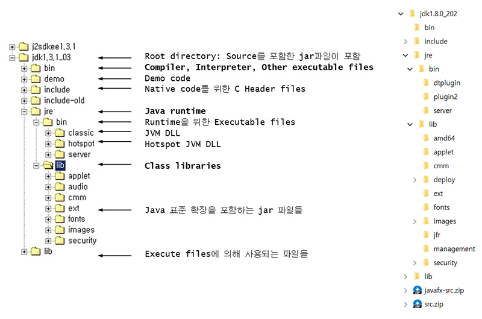

- 
- 
- 

# Java
- Programming Language vs. Program vs. Programming vs. Programmer
- Programming Language(Java vs. C/C++ 등)의 종류와 특성
- Program(Standalone vs. OS 기반 Server/Client vs. Web 기반 Server/Client 등)의 종류와 특성
- Web Program(Static vs. Dynamic)의 종류와 특성
- Eclipse vs. STS(Spring Tool Suite)
- Framework(Struts, Spring 등)
- 호랑이는 죽어서 가죽을 남기고 사람은 죽어서 이름을 남기고 개발자는 죽어서 코드(네트워크와 서버에)를 남긴다.
- [학습 목표] 1) 관리자 구현 2) API 구현

# Contents
1. 개발 환경
2. 특징 및 기본 문법
3. 클래스와 객체 그리고 배열
4. 상속과 다형성
5. 추상 클래스와 인터페이스
6. 주요 클래스와 예외 처리
7. 입출력과 스트림
8. 자바 응용 소프트웨어 개발을 위한 설계 및 구현 그리고 고객 편의성

# 개발 환경
## 자바(Java) 개발 환경
- Java Standard/Enterprise/Micro Edition 그리고 JDK(Java Development Kit) vs. JRE(Java Runtime Environment)
- JDK 다운로드와 설치
- 환경 설정(JAVA_HOME과 PATH 등)
- System.out.println("Hello, World!");

## 이클립스(Eclipse)
- 다운로드와 설치
- Workspace와 Project
- System.out.println("Hello, World!");

## Eclipse 설정 및 사용법
- Default Workspace Encoding
- Editor Environment
	- Line Number
	- White Space
	- Spelling(dictionary)
- 자동 완성(Ctrl + Space)
- [Code Template & Configuration](../../Development/Eclipse/README.md)
- [Plug-in](../../Development/Eclipse/README.md)

## To be continue

# 특징 및 기본 문법
## About Java
- Java history
	- Copyright 1990s © Sun Microsystems, James Gosling
	- Base language는 UCSD Pascal, C++
	- Netscape Navigator 2.0 + Java Applet on Internet
- Java Program
	- Java Applet(Web Browser에서 실행되며 Windows의 ActiveX와 유사)
	- Java Application-AWT/Swing(Console 또는 Window 형태로 Local에서 실행되며 Windows의 EXE와 유사)
	- Java Servlet(Applet과 달리 Server에서 실행되며 Post나 Get 방식으로 사용자의 입력 처리가 가능)
	- JSP(Java Server Page, Server 기반으로 동적 Web Page를 생성하며 Windows의 ASP와 유사)
	- Java Beans(Java에서 재사용이 가능한 Software Object를 만드는 기술의 결과로 만들어진 Component로서 각종 다양한 목적을 위한 소형 Module로 Windows의 DLL과 유사)
	- EJB(Enterprise Java Beans, EJB는 확장성 있는 Application Server Component들을 지원하는 여러 Service들을 제공함으로써 Business Application들을 Component 단위로 쉽게 작성할 수 지원하며 Windows의 .NET과 유사)
- Java Characteristic
	- Scalability(From enterprise system to small device)
	- Light and easy code + Real OOP(But OOP is not easy)
	- Independent platform(Byte code at JVM: Write once, run everywhere)
	- Source Charset support UTF-16 vs. UTF-8 vs. ANSI
- Java vs. C++ and procedure, structured programming
	- Remove pointer, structure, union
	- All code in class
- Java Folder

- Class library Source: C:\jdk*\src.jar vs. C:\Program Files\Java\jdk*\src.zip

## Compile and run
- For Beginner: 99%
	- Text Error
	- Syntax Error
	- Case Sensitive
	- Edit > Save > Compile > Run
- Compile
	- C:\Examle\javac HelloWorld.java

- Run
	- C:\Example\java HelloWorld
	- C:\Example\appletviewer ExApplet.html
- Error vs. Warning

## 주석과 문장 그리고 변수와 상수 및 자료형
- 주석
	- //
	- /* … */
	- /** … * /
	- 주석 for Java Doc
- 문장(sentence or statement, ;)
- 변수 선언(예약어 등 제약 사항, 카멜 표기법)과 상수(final), 자료형(정수, 실수, 문자, 문자열, 논리형 등) 그리고 초기화(initialize) 또는 대입(assign)
- 묵시적(자동) 형변환 vs. 명시적(강제) 형변환

## 연산자와 우선 순위
- 단항, 이항, 삼항
- 대입, 부호, 산술, 증가, 감소, 관계(비교), 논리, 복합 대입, 조건, 비트, 시프트

## 제어문
### 조건문(Conditional Statements)
- if
- if/else
- if/else if
- if/else if/else
- switch/case

### 반복문(Loop Statements)
- while
- do/while
- for
- break와 continue

# 클래스와 객체 그리고 배열
## 객체 지향 프로그래밍(OOP, Object Oriented Programming)과 클래스(Class)
- 객체(Object) =  속성(Property or Attribute) + 메서드(Method)단독이 아닌 객체에 속한 함수라는 의미에서 메서드란 이름 부여(속성도 동일함)
- 클래스(Class) = 멤버 변수(Membership Field) + 멤버 함수(Member Function)
- 패키지(Package)
- 절차 지향 프로그래밍 vs. 객체 지향 프로그래밍(OOP, Object Oriented Programming)
- 패키지(Package)와 클래스(Class) 선언과 멤버 변수(Membership Field)와 멤버 함수(Member Function) 정의

## 메서드(Method) 또는 함수(Function)
- 반환형 이름(매개변수) { …; return 반환값; }

## 클래스(Class)와 인스턴스(Instance)
- 클래스형 변수명 = new 생성자;

## 생성자(Constructor)
- 디폴트 생성자와 매개 변수 생성자

## 접근 제어자(Access Modifier)
- public, protected, private, DEFALUT(같은 패키지 내부에서만 접근 가능)

## 기타
- this
- static 변수(=클래스 변수)와 메서드(=클래스 메서드)
- 변수의 유효 범위: 지역(Local) 변수, 멤버(Instance) 변수, 클래스(Static) 변수

## 배열(Array)
- 배열의 선언(객체 포함)과 초기화 그리고 Index
- 배열의 크기와 사용
- 배열의 복사(System.arraycopy()) 그리고 배열의 주소 복사(shallow copy) vs. 값 복사(deep copy)
- 다차원 배열
- ArrayList 클래스(선언 시 크기 지정 없음)

# 상속과 다형성

# 추상 클래스와 인터페이스

# 주요 클래스와 예외 처리

# 입출력과 스트림

# 자바 응용 소프트웨어 개발을 위한 설계 및 구현 그리고 고객 편의성